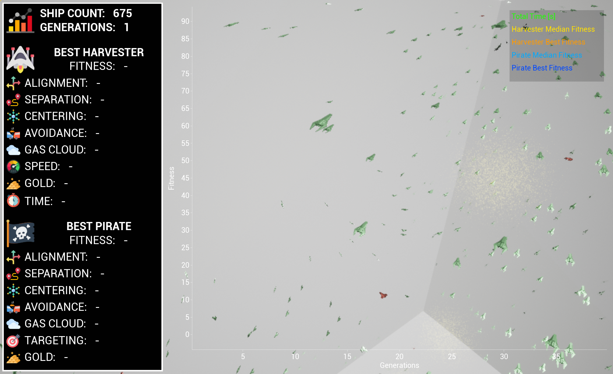
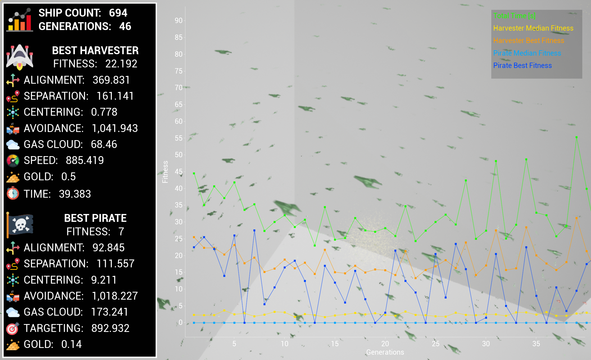

# Artificial Life - Evolution Assignment 

**Harrison Verrios**

20 May 2022


## Installation
**Unreal Version:** 4.27<br>
**Devices:** Windows / Mac

Running the Unreal application on any valid device will result with the following output when the *Play* button is clicked:




---

## Brief
For this assignment, you will be required to implement and evolve flocking ship agents within a 3D space. There are 2 ship agents that are required to be implemented: Harvester Ships and Pirate Ships. Each ship type will also require evolution to be implemented with certain restrictions applied. The goal of the Harvester ships is to search the environment for gas clouds containing gold, whilst avoiding nearby ships and obstacles. The Pirate ships should attempt to attack Harvestor ships and steal their gold. Each of the ships are modelled using a **BOID** agent, which attempts to align its velocity with nearby voids, separate them from colliding and flock to the center of nearby ships. Additionally, each ship has a **fixed-length genome** with a range of strength values that allow it to evolve over time and improve it's statistics. The evolution manager will deal with evolving these agents.


---

## Genome

The two BOID types both have a DNA, implemented using a fixed-length genotype. This means that the number of genes in the phenotype does not change over the evolutionary lifetime. Each gene has a floating point number that is associated with a particular property of the agent. The values will change over the evolutionary lifetime, but will not change during a single generation. This is handled by the *DNA* structure class, which an instance of is stored within each of the BOIDs. Each of the two types of ships have 6 genomes, but only share the first 5 genomes. These are associated with the following properties:
- **VelocityStrength:** The strength applied to move a BOID towards neighbouring BOID types.
- **Separation Strength:** The strength applied to ensure that two BOIDs do not collide or hit each other; this would cause a death.
- **Centering Strength:** The strength applied to move BOIDs to the center of the flock, by checking the location of other BOIDs.
- **AvoidanceStrength:** The strength applied to move BOIDs away from obstacles, such as the walls of the level.
- **GasCloudStrength:** The strength applied to move BOIDs towards localised gas clouds that may contain gold (or in the case of the pirate, some treasure-hunting harvesters).

Additionally, each type of ship has a sixth gene. The Harvester ship is able to alter its speed with an additional parameter:
- **Speed Strength:** The additional value that is applied on top of the fixed max speed, allowing the BOID to travel faster. This is divided by 5 when implemented.

The Pirate ship attempts to target nearby Harvesters. It does this by looking for any alive ships within its perception range. It has an additional genome for this:
- **Target Strength:** The strength applied to move the BOIDs towards other BOIDs, of a particular type, used for hunting the Harvester ships.

---

## Fitness Function

A **fitness function** calculates the fitness of a particular entity at the end of a simulated generation. The fitness function is designed to ensure that the fittest and best individuals carry their genes on to the next generation. The *BOID* class handles the fitness calculation once the generation ends. This may occur when a BOID is dead or if it is still alive at the end. Each type of ship has it's own goals, so the fitness functions are not the same for each type.

The Harvester ship's goal is to collect gold whilst staying alive for as long as possible. As such, the fitness function should be dependent on the total values of these two factors at the end of the generation. The fitness calculation is done by multiplying each value by a set weighting and adding them up. The weights were adjusted when testing the simulation, but do not change during the evolution lifetimes. As the fitness function must remain fixed during evolution, these weightings are constant. Currently the fitness function exists such that:

>$ \mathrm{fitness} = 0.5t + 5g $

where $t$ is the time alive in seconds and $g$ is the total gold collected at the end of the generation.

The Pirate ship's only goal is to plunder gold from Harvester ships. As such, they are not concerned about how long they live for during a generation. This fitness function is only based on the total gold collected from the ships, along with the number of ships plundered. A constant scale factor is applied to the fitness to ensure that the numbers are appropriate.

>$ \mathrm{fitness} = 50g + 5p $

where $p$ is the number of ships plundered and $g$ is the total gold collected at the end of the generation.

Additionally, in both cases, the fitness is affected by the cause of the death, if any. If the ship does not die and is still alive at the end of the generation, it's fitness is the calculated one. Otherwise, if the ship collides with a wall, it will lose 25% of its fitness. If it collides with another BOID, it will lose 25% of its fitness. However, if a Harvester collides with a Pirate, it will only lose 50% of its fitness. These rules are defined by the assignment brief.

---

## Evolution

The evolution of the phenotypes are handled by the *Evolution Manager* class. The game will create two instances of these managers; one for each type of BOID. This will ensure that each species has its own manager for storing the population of the DNA and abstracts the functionality of evolution away from the Ship Spawner, which is in control of spawning the agents into the world. At the beginning of the simulation, at $t=0$, the DNA is set to a series of default values, that is different for each type of BOID. These values are defined in the *HarvesterBOID* and *PirateBOID* classes, in the *SetDefaultGenes* method.

#### Parent Selection

At the end of a generation, all Evolution Managers will select new parents to create children. I have implemented a ranking algorithm, that prioritises the parents with higher fitnesses. In the case of the Harvester ships, only 20 parents will be selected (although this parameter can be adjusted). The population is ordered based on fitness value and the top 20 genes are selected for parenting. A function creates a probability that favours better parents than others when selecting a new parent to breed with. This function states that the best parent will be 20 times more likely to be chosen than the 20th parent, while the 5th parent will be 3 times more likely to be chosen than the 15th parent. This is done using the following formula:

>$ p_i = {2(n - i) \over n(n+1)}$

where $p_i$ is the probability that parent with rank $i$ will be chosen out of the top $n$ parents. This is implemented using the following function in code, which creates an array with indexes of what parent to select:

```
TArray<int> RankingIndex;
  for (int Rank = 0; Rank < NumSelectedParents; ++Rank)
    for (int i = 0; i < (NumSelectedParents - Rank); ++i)
      RankingIndex.Add(Rank);
```

#### Child Creation

Once the parents are selected, a new population of children are created. In this system, we will use parent replacement, such that an entire new population set is created. Every child is created from a set of two random parents from the list, as defined above. The parents of the new child can be the same parent if by chance. Once the two parents are decided for this particular child, then a **crossover** will occur. This will divide the two parent's genes by half and create a new child based on the previous genes. This could be split by 2/4, 3/3 or 4/2, based on chance. The new child will now have approximately 50% of the genes from each parent. Next, a **mutation** can occur. Depending on the mutation rate set in the *Evolution Manager*, a child may be able to mutate. If so, then any number of its six genes can adjust their values slightly. I have programmed the mutation so that during each generation, the gene values can change anywhere between -7% and +7% of its current value. This ensures that the genes can become optimal after a long enough period of time.

#### Population Replacement

At the end of the child creation, the ships are respawned into the world and their DNA are replaced by the new population. However, for a tiny fraction of the ships, their gene's are reset to the default values. These ensure that if by chance the evolution is becoming non-ideal, a fresh set of DNA can prevail and provide better fitnesses. This process occurs in both types of BOIDs.

---

## Graphing

To help determine the starting parameters for the BOIDs, I have created a graph overlay to the screen that shows the current statistics from the generations. This graph shows 5 values that are listed in the legend (top-right corner):
- **Total Time:** The time taken in seconds for a generation to simulate
- **Harvester Median Fitness:** The median fitness value of the harvester population at the end of the generation.
- **Harvester Best Fitness:** The best fitness value of the harvester population at the end of the generation.
- **Pirate Median Fitness:** The median fitness value of the pirate population at the end of the generation.
- **Pirate Best Fitness:** The best fitness value of the pirate population at the end of the generation.

This graph will show new data points at the conclusion of each generation. This may take some time to show, if the generation is successful and avoids potential collisions.

Additionally, the information in the side-panel shows the best Harvester and best Pirate ship from the previous generation, and what their genome values were. It also shows the amount of gold they collected, their final fitness value and the time they lived for (in the case of the Harvesters).

The following image shows what the simulation may look like at the end of the simulation, after multiple generations.



---


## Credits
All images and icons have been provided under a free-to-use, non-commercial license from
<a href="https://www.flaticon.com/authors/freepik" title="error icons">Freepik - Flaticon</a>. These include the following images that can be location inside the AI_Evolution/Content/Textures folder:
- avoidance.png
- centralized.png
- cloud.png
- gold.png
- pirate.png
- separation.png
- spaceship.png
- speed.png
- stats.png
- target.png
- timer.png
- velocity.png